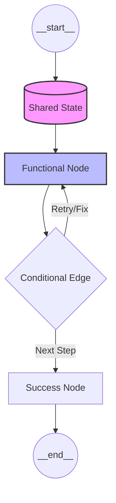

# � Stateful: Advanced Agentic Orchestration with LangGraph

**Stateful** is an engineering-first framework designed for building resilient, cyclic, and multi-agent AI systems. Moving beyond simple Directed Acyclic Graphs (DAGs), this repository serves as a masterclass in durable execution, state persistence, and complex agent orchestration using the **LangGraph** ecosystem.

> [!IMPORTANT]
> **Stateful AI vs. Chains**: Traditional chains (LangChain) follow a fixed path. **Stateful** systems use cyclic architectures that allow agents to reason, act, observe, and correct their own state in a continuous loop.

---

## 🏗️ Core Architecture: The Pregel Model

LangGraph is inspired by Google's **Pregel** algorithm. It treats agent workflows as a series of "super-steps" where nodes execute in parallel and pass messages along edges to update a shared state.



---

## 🛠️ Key Technical Pillars

### 1. State & Reducers
In **Stateful**, memory is managed through a central `State` object (typically a `TypedDict`).
- **Channels**: Every key in the state is a channel.
- **Reducers**: Custom functions (using `Annotated` and `operator.add`) define how new updates merge with existing data.

### 2. Durable Execution (Checkpointing)
Built-in resilience allows agents to survive application crashes. By using a **Checkpointer**, the graph automatically saves its state after every super-step. 
- **Time Travel**: Snapshotting allows you to revert to *any* previous state of the graph for debugging or human feedback.

### 3. Human-in-the-Loop (HITL)
**Stateful** patterns implement `interrupt_before` and `interrupt_after` to pause execution, allowing human supervisors to inspect state, edit it, and manually trigger transitions.

---

## � Interactive Curriculum

This repository is structured as a progressive learning path:

| Level | Component | Focus | Resource |
| :--- | :--- | :--- | :--- |
| **01** | **[BMI Workflow](file:///c:/Users/91800/Desktop/AIAGENTSCampusx/1)bmi_workflow.ipynb)** | Foundational Graphs | Managing numeric state and simple deterministic edges. |
| **02** | **[LLM Blog Engine](file:///c:/Users/91800/Desktop/AIAGENTSCampusx/2)llm_workflow.ipynb)** | Prompt Chaining | Orchestrating multiple LLM calls for structured output. |
| **03** | **[Parallel Analytics](file:///c:/Users/91800/Desktop/AIAGENTSCampusx/3)parallel_workflow.ipynb)** | Optimization | Fan-out/Fan-in patterns for multi-perspective analysis. |
| **Theory** | **[The Deep-Dive Guide](file:///c:/Users/91800/Desktop/AIAGENTSCampusx/langgraph_comprehensive_guide.md)** | Architectural Theory | Comprehensive documentation on Nodes, Edges, and Persistence. |

---

## � Advanced Module Reference (v1.0+)

**Stateful** integrates patterns found in the latest LangGraph updates (2025-2026):

- **LangGraph Swarm**: Agent collaboration workflows where control shifts dynamically based on task requirements.
- **LangGraph Supervisor**: Hierarchical orchestration where a "Manager" LLM assigns sub-tasks to workers.
- **Guardrail Nodes**: Integrated nodes for content moderation, retry-logic middleware, and compliance logging.
- **BigTool Support**: Scalable tool access patterns for agents handling hundreds of available functions.

---

## 💻 Tech Stack
- **Execution Engine**: LangGraph 1.0 Runtime
- **Orchestration**: LangChain Core
- **Intelligence**: 
  - **Local**: DeepSeek-R1, Phi-4 (via 🔥 Ollama)
  - **Cloud**: Llama-3.1-405B, Llama-3.3 (via 🔥 Groq)

---

## 🏁 Getting Started

1.  **Clone & Install**:
    ```bash
    git clone https://github.com/your-username/Stateful.git
    pip install langgraph langchain_groq langchain_ollama python-dotenv
    ```
2.  **Configure API**: Create `.env` and add `GROQ_API_KEY`.
3.  **Run Models**: Start Ollama and pull specific models:
    ```bash
    ollama pull deepseek-r1:8b
    ```

---

> [!TIP]
> **Pro Debugging**: Use `graph.get_graph().draw_mermaid_png()` to verify your architecture visually before deployment.
