```mermaid
graph LR
    START(("__start__")) --> Outline["🗒️ Generate Outline"]
    Outline --> Writer["✍️ Write Content"]
    Writer --> Editor["🔍 Polish & Edit"]
    Editor --> END(("__end__"))
```

```mermaid
graph TD
    START(("__start__")) --> Orch["🎯 Orchestrator<br/>(Plans Sections)"]
    Orch -- "Send(worker, Section 1)" --> W1["👷 Worker 1"]
    Orch -- "Send(worker, Section 2)" --> W2["👷 Worker 2"]
    Orch -- "Send(worker, Section N)" --> WN["👷 Worker N"]
    W1 --> Synth["📋 Synthesizer"]
    W2 --> Synth
    WN --> Synth
    Synth --> END(("__end__"))

    style Orch fill:#ff9,stroke:#333,stroke-width:2px
    style Synth fill:#9f9,stroke:#333,stroke-width:2px
```

# 🧠 LangGraph — Complete Guide to All Workflow Types

> **Source:** Official LangGraph Documentation ([docs.langchain.com/oss/python/langgraph](https://docs.langchain.com/oss/python/langgraph/workflows-agents))
> **Last Updated:** February 2026
> **Models Used:** Groq (LLaMA 3.3), Ollama (Llama 3.2 / Mistral), Google Gemini 2.0 Flash

---

## 📑 Table of Contents

| # | Workflow Type | Description |
|---|---|---|
| 1 | [Prompt Chaining](#1--prompt-chaining-workflow) | Sequential LLM calls — output of one feeds the next |
| 2 | [Parallelization](#2--parallelization-fan-out--fan-in-workflow) | Multiple LLM calls run simultaneously, results aggregated |
| 3 | [Routing / Conditional](#3--routing--conditional-workflow) | LLM decides which path to take via conditional edges |
| 4 | [Orchestrator-Worker](#4--orchestrator-worker-workflow) | Manager LLM delegates sub-tasks to worker nodes |
| 5 | [Evaluator-Optimizer](#5--evaluator-optimizer-workflow) | Generate → Evaluate → Refine loop until quality is met |
| 6 | [Autonomous Agent](#6--autonomous-agent-workflow-tool-calling) | LLM autonomously decides when to use tools in a loop |
| 7 | [Human-in-the-Loop](#7--human-in-the-loop-hitl-workflow) | Pause execution for human approval/input before continuing |
| 8 | [Subgraph / Nested](#8--subgraph--nested-workflow) | Compose multiple graphs as reusable sub-components |

---

## 🔧 Prerequisites & Installation

```bash
pip install langgraph langchain-core langchain-groq langchain-ollama langchain-google-genai pydantic
```

---

## 🔑 Setting Up All Three Models (Groq, Ollama, Gemini)

Every example below can swap between these models. Here is the setup for each:

```python
import os
from dotenv import load_dotenv
load_dotenv()

# ─────────────────────────────────────────────
# 1. GROQ (Cloud — Fast Inference for Open Models)
# ─────────────────────────────────────────────
# Requires: GROQ_API_KEY in your .env file
# Models: llama-3.3-70b-versatile, llama-3.1-8b-instant, mixtral-8x7b-32768
from langchain_groq import ChatGroq

groq_llm = ChatGroq(
    model="llama-3.3-70b-versatile",
    api_key=os.getenv("GROQ_API_KEY"),
    temperature=0.7,
)

# ─────────────────────────────────────────────
# 2. OLLAMA (Local — Run Models On Your Machine)
# ─────────────────────────────────────────────
# Requires: Ollama running locally (ollama serve)
# Models: llama3.2, mistral, phi4-mini, gemma2
# First pull a model: ollama pull llama3.2
from langchain_ollama import ChatOllama

ollama_llm = ChatOllama(
    model="llama3.2",      # or "mistral", "phi4-mini", etc.
    base_url="http://localhost:11434",
    temperature=0.7,
)

# ─────────────────────────────────────────────
# 3. GOOGLE GEMINI (Cloud — Google's Multimodal AI)
# ─────────────────────────────────────────────
# Requires: GOOGLE_API_KEY in your .env file
# Models: gemini-2.0-flash, gemini-1.5-pro, gemini-1.5-flash
from langchain_google_genai import ChatGoogleGenerativeAI

gemini_llm = ChatGoogleGenerativeAI(
    model="gemini-2.0-flash",
    google_api_key=os.getenv("GOOGLE_API_KEY"),
    temperature=0.7,
)

# ─────────────────────────────────────────────
# Pick which model to use for the examples below
# Change this ONE line to switch models everywhere
# ─────────────────────────────────────────────
llm = groq_llm  # <-- Change to ollama_llm or gemini_llm
```

> **💡 Tip:** Throughout this guide, `llm` is the variable used. Swap between `groq_llm`, `ollama_llm`, or `gemini_llm` to test with different providers!

---

## 🗂️ LangGraph Core Concepts (Quick Reference)

Before diving into workflows, here are the building blocks:

| Concept | What It Does | Code |
|---|---|---|
| **State** | Shared memory across all nodes (a `TypedDict`) | `class State(TypedDict): ...` |
| **Node** | A Python function that reads/writes state | `workflow.add_node("name", func)` |
| **Edge** | Fixed connection from one node to another | `workflow.add_edge("A", "B")` |
| **Conditional Edge** | Dynamic routing based on state | `workflow.add_conditional_edges(...)` |
| **START / END** | Special sentinel nodes for entry/exit | `from langgraph.graph import START, END` |
| **Reducer** | Controls how concurrent writes merge (e.g. `operator.add` appends to lists) | `Annotated[list, operator.add]` |
| **Checkpointer** | Persists state for resume, time-travel, human-in-loop | `MemorySaver()` or database-backed |
| **`Send()` API** | Dynamically spawn parallel worker instances | `from langgraph.types import Send` |
| **`interrupt()`** | Pause graph execution for human input | `from langgraph.types import interrupt` |
| **`Command()`** | Resume or route execution after interrupt | `from langgraph.types import Command` |

### Visual Representation


---

## 1. 🔗 Prompt Chaining Workflow

### 📖 Theory

**Prompt Chaining** is the simplest workflow pattern. The output of one LLM call becomes the input for the next. Think of it as a **pipeline** where data flows through sequential transformation stages.

**When to use:**
- Multi-step content generation (outline → draft → polish)
- Document translation chains (translate → verify → format)
- Data extraction pipelines (extract → validate → structure)

**Real-Life Example:** A blog publishing workflow:
1. **Outline Generator** → creates a structured outline from a topic
2. **Content Writer** → writes the full article from the outline
3. **Editor** → polishes grammar, tone, and adds a conclusion

### 🏗️ Architecture



### 💻 Code — Using Groq

```python
import os
from typing import TypedDict
from dotenv import load_dotenv
from langgraph.graph import StateGraph, START, END
from langchain_groq import ChatGroq

load_dotenv()

# ── Model Setup ──
llm = ChatGroq(model="llama-3.3-70b-versatile", api_key=os.getenv("GROQ_API_KEY"))

# ── State Definition ──
class State(TypedDict):
    topic: str
    outline: str
    draft: str
    final_article: str

# ── Node Functions ──
def generate_outline(state: State):
    """Step 1: Create a structured outline from the topic."""
    prompt = f"Create a detailed outline with 5 sections for an article about: {state['topic']}"
    response = llm.invoke(prompt)
    return {"outline": response.content}

def write_draft(state: State):
    """Step 2: Write the full draft using the outline."""
    prompt = f"""Using this outline, write a comprehensive article.
    
    OUTLINE:
    {state['outline']}
    
    Write in a professional tone with clear explanations."""
    response = llm.invoke(prompt)
    return {"draft": response.content}

def polish_article(state: State):
    """Step 3: Polish the draft — fix grammar, improve flow, add conclusion."""
    prompt = f"""Polish this article draft. Improve:
    1. Grammar and clarity
    2. Transitions between sections
    3. Add a compelling conclusion
    
    DRAFT:
    {state['draft']}"""
    response = llm.invoke(prompt)
    return {"final_article": response.content}

# ── Build the Graph ──
workflow = StateGraph(State)

workflow.add_node("outliner", generate_outline)
workflow.add_node("writer", write_draft)
workflow.add_node("editor", polish_article)

workflow.add_edge(START, "outliner")     # Entry point
workflow.add_edge("outliner", "writer")  # Outline → Writer
workflow.add_edge("writer", "editor")    # Writer → Editor
workflow.add_edge("editor", END)         # Editor → Done

app = workflow.compile()

# ── Run It ──
result = app.invoke({"topic": "The Future of Renewable Energy"})
print("📝 FINAL ARTICLE:")
print(result["final_article"])
```

### 💻 Code — Same Workflow with Ollama (Local)

```python
from langchain_ollama import ChatOllama

# Just swap the model — everything else stays the same!
llm = ChatOllama(model="llama3.2", base_url="http://localhost:11434")

# ... (same State, nodes, and graph as above)
```

### 💻 Code — Same Workflow with Gemini

```python
from langchain_google_genai import ChatGoogleGenerativeAI

# Swap to Gemini
llm = ChatGoogleGenerativeAI(
    model="gemini-2.0-flash",
    google_api_key=os.getenv("GOOGLE_API_KEY"),
)

# ... (same State, nodes, and graph as above)
```

### 🔑 Key Takeaways

| Aspect | Detail |
|---|---|
| **Flow** | Linear: A → B → C → END |
| **Edges** | All `add_edge()` — no conditions |
| **When to use** | Tasks that are naturally sequential |
| **Limitation** | A later step can't "go back" — for that, use Evaluator-Optimizer |

---

## 2. ⚡ Parallelization (Fan-out / Fan-in) Workflow

### 📖 Theory

**Parallelization** runs multiple LLM calls at the same time and then aggregates the results. LangGraph automatically detects when multiple edges leave the `START` node (or the same source node) and executes those branches **concurrently**.

Two main sub-patterns:
- **Sectioning:** Different tasks run in parallel (e.g., joke + story + poem)
- **Voting:** Same task runs multiple times for consensus (e.g., 3 graders score an essay)

**When to use:**
- Multi-perspective analysis (technical + fundamental + sentiment)
- Parallel content generation
- Multiple evaluation criteria running simultaneously

**Real-Life Example:** Stock market research:
1. 📊 **Technical Analyst** — runs chart pattern analysis
2. 📑 **Fundamental Analyst** — reviews earnings and financials
3. 💬 **Sentiment Analyst** — scans social media and news
4. 🧠 **Aggregator** — combines all three into a final recommendation

### 🏗️ Architecture



```mermaid
graph TD
    START(("__start__")) --> Joke["🤣 Generate Joke"]
    START --> Story["📖 Write Story"]
    START --> Poem["📜 Compose Poem"]
    Joke --> Agg["🧩 Aggregator"]
    Story --> Agg
    Poem --> Agg
    Agg --> END(("__end__"))
```

### 💻 Code — Using Gemini

```python
import os
from typing import TypedDict
from dotenv import load_dotenv
from langgraph.graph import StateGraph, START, END
from langchain_google_genai import ChatGoogleGenerativeAI

load_dotenv()

# ── Gemini Model ──
llm = ChatGoogleGenerativeAI(
    model="gemini-2.0-flash",
    google_api_key=os.getenv("GOOGLE_API_KEY"),
)

# ── State ──
class State(TypedDict):
    topic: str
    joke: str
    story: str
    poem: str
    combined_output: str

# ── Parallel Nodes (all run simultaneously) ──
def generate_joke(state: State):
    """Branch 1: Generate a joke"""
    msg = llm.invoke(f"Write a short, witty joke about {state['topic']}")
    return {"joke": msg.content}

def write_story(state: State):
    """Branch 2: Write a micro-story"""
    msg = llm.invoke(f"Write a 3-paragraph short story about {state['topic']}")
    return {"story": msg.content}

def compose_poem(state: State):
    """Branch 3: Compose a poem"""
    msg = llm.invoke(f"Write a 4-line rhyming poem about {state['topic']}")
    return {"poem": msg.content}

# ── Aggregator Node (waits for all branches) ──
def aggregator(state: State):
    """Fan-in: Combine all parallel outputs into one"""
    combined = f"""🎭 Creative Collection about '{state['topic']}'
    
{'='*50}
🤣 JOKE:
{state['joke']}

{'='*50}
📖 STORY:
{state['story']}

{'='*50}
📜 POEM:
{state['poem']}
"""
    return {"combined_output": combined}

# ── Build the Parallel Graph ──
builder = StateGraph(State)

builder.add_node("joke_gen", generate_joke)
builder.add_node("story_gen", write_story)
builder.add_node("poem_gen", compose_poem)
builder.add_node("aggregator", aggregator)

# Fan-out: START connects to ALL three nodes
builder.add_edge(START, "joke_gen")
builder.add_edge(START, "story_gen")
builder.add_edge(START, "poem_gen")

# Fan-in: ALL three connect to the aggregator
builder.add_edge("joke_gen", "aggregator")
builder.add_edge("story_gen", "aggregator")
builder.add_edge("poem_gen", "aggregator")

builder.add_edge("aggregator", END)

parallel_app = builder.compile()

# ── Run It ──
result = parallel_app.invoke({"topic": "artificial intelligence"})
print(result["combined_output"])
```

### 💻 Code — Same Workflow with Groq

```python
from langchain_groq import ChatGroq

llm = ChatGroq(model="llama-3.3-70b-versatile", api_key=os.getenv("GROQ_API_KEY"))
# ... (same State, nodes, and graph as above)
```

### 🔑 Key Takeaways

| Aspect | Detail |
|---|---|
| **Flow** | Fan-out from START, fan-in to aggregator |
| **Speed** | Much faster than sequential — all branches run at the same time |
| **State Writes** | Each branch writes to a **different** key — no conflict |
| **For same-key writes** | Use a `Reducer` (e.g., `Annotated[list, operator.add]`) |

---

## 3. 🔀 Routing / Conditional Workflow

### 📖 Theory

**Routing** lets the LLM (or custom logic) dynamically choose which path to take. This is done via `add_conditional_edges()` — a function inspects the current state and returns the name of the next node to execute.

Two approaches:
1. **LLM-based routing:** The LLM uses structured output to classify the request
2. **Rule-based routing:** Simple Python logic (e.g., keyword matching)

**When to use:**
- Customer support triage (billing vs. tech vs. general)  
- Content classification (poem vs. story vs. code)
- Multi-language routing
- Priority queue assignment

**Real-Life Example:** Customer support chatbot:
- User says "I can't log in" → routes to **Tech Support Agent**
- User says "Refund my order" → routes to **Billing Agent**
- User says "Hello" → routes to **General Agent**

### 🏗️ Architecture



```mermaid
graph TD
    START(("__start__")) --> Router["🔀 LLM Router"]
    Router -- "poem" --> PoemNode["📜 Poem Writer"]
    Router -- "story" --> StoryNode["📖 Story Writer"]
    Router -- "joke" --> JokeNode["🤣 Joke Writer"]
    PoemNode --> END(("__end__"))
    StoryNode --> END
    JokeNode --> END

    style Router fill:#ff9,stroke:#333,stroke-width:2px
```

### 💻 Code — Using Groq with Structured Output

```python
import os
from typing import TypedDict
from typing_extensions import Literal
from dotenv import load_dotenv
from pydantic import BaseModel, Field
from langgraph.graph import StateGraph, START, END
from langchain_groq import ChatGroq
from langchain_core.messages import HumanMessage, SystemMessage

load_dotenv()

# ── Model ──
llm = ChatGroq(model="llama-3.3-70b-versatile", api_key=os.getenv("GROQ_API_KEY"))

# ── Routing Schema (Structured Output) ──
class Route(BaseModel):
    """The LLM fills this schema to decide the route."""
    step: Literal["poem", "story", "joke"] = Field(
        description="The type of creative content to generate."
    )

# Augment LLM with structured output for routing
router_llm = llm.with_structured_output(Route)

# ── State ──
class State(TypedDict):
    user_input: str
    decision: str
    output: str

# ── Nodes ──
def router_node(state: State):
    """LLM-based router: classifies the user request."""
    decision = router_llm.invoke([
        SystemMessage(content="Classify the user's request into: poem, story, or joke."),
        HumanMessage(content=state["user_input"]),
    ])
    return {"decision": decision.step}

def write_poem(state: State):
    """Write a poem based on the user's request."""
    msg = llm.invoke(f"Write a beautiful poem based on this request: {state['user_input']}")
    return {"output": msg.content}

def write_story(state: State):
    """Write a story based on the user's request."""
    msg = llm.invoke(f"Write a compelling short story based on this request: {state['user_input']}")
    return {"output": msg.content}

def write_joke(state: State):
    """Write a joke based on the user's request."""
    msg = llm.invoke(f"Write a hilarious joke based on this request: {state['user_input']}")
    return {"output": msg.content}

# ── Conditional Edge Function ──
def route_decision(state: State):
    """Returns the name of the next node based on the LLM's classification."""
    if state["decision"] == "poem":
        return "poem_node"
    elif state["decision"] == "story":
        return "story_node"
    else:
        return "joke_node"

# ── Build Graph ──
builder = StateGraph(State)

builder.add_node("router", router_node)
builder.add_node("poem_node", write_poem)
builder.add_node("story_node", write_story)
builder.add_node("joke_node", write_joke)

builder.add_edge(START, "router")

# Conditional routing from the router node
builder.add_conditional_edges(
    "router",
    route_decision,
    {
        "poem_node": "poem_node",
        "story_node": "story_node",
        "joke_node": "joke_node",
    },
)

builder.add_edge("poem_node", END)
builder.add_edge("story_node", END)
builder.add_edge("joke_node", END)

routing_app = builder.compile()

# ── Run It ──
result = routing_app.invoke({"user_input": "Tell me a funny story about a cat"})
print(f"🔀 Route taken: {result['decision']}")
print(f"\n📄 Output:\n{result['output']}")
```

### 💻 Code — Same Workflow with Ollama

```python
from langchain_ollama import ChatOllama

llm = ChatOllama(model="mistral", base_url="http://localhost:11434")

# Note: For structured output with Ollama, you may need to use
# a model that supports function calling (e.g., mistral, llama3.2)
router_llm = llm.with_structured_output(Route)
# ... (same State, nodes, and graph as above)
```

### 💻 Code — Same Workflow with Gemini

```python
from langchain_google_genai import ChatGoogleGenerativeAI

llm = ChatGoogleGenerativeAI(
    model="gemini-2.0-flash",
    google_api_key=os.getenv("GOOGLE_API_KEY"),
)
router_llm = llm.with_structured_output(Route)
# ... (same State, nodes, and graph as above)
```

### 🔑 Key Takeaways

| Aspect | Detail |
|---|---|
| **Core API** | `workflow.add_conditional_edges(source, func, mapping)` |
| **Router function** | Returns a **string** matching a key in the mapping dict |
| **LLM-based routing** | Use `with_structured_output()` for reliable classification |
| **Rule-based routing** | Simple `if/else` on state values — faster, no LLM needed |

---

## 4. 🎯 Orchestrator-Worker Workflow

### 📖 Theory

The **Orchestrator-Worker** pattern uses a "manager" LLM to break a complex task into sub-tasks and then dynamically spawns worker nodes to handle each sub-task in parallel. This is the pattern behind many autonomous agent systems.

**Key innovation:** The `Send()` API — this lets you dynamically create N worker instances at runtime, where N is determined by the orchestrator's plan.

**When to use:**
- Report generation (plan sections → write each section → combine)
- Code generation (plan modules → write each module → integrate)
- Research synthesis (identify topics → research each → synthesize)

**Real-Life Example:** Automated report writer:
1. **Orchestrator** → plans 5 report sections with titles and descriptions
2. **Workers** (5 parallel instances) → each writes one section
3. **Synthesizer** → combines all sections into the final report

### 🏗️ Architecture



### 💻 Code — Using Groq

```python
import os
import operator
from typing import TypedDict, Annotated, List
from dotenv import load_dotenv
from pydantic import BaseModel, Field
from langgraph.graph import StateGraph, START, END
from langgraph.types import Send
from langchain_groq import ChatGroq
from langchain_core.messages import SystemMessage, HumanMessage

load_dotenv()

llm = ChatGroq(model="llama-3.3-70b-versatile", api_key=os.getenv("GROQ_API_KEY"))

# ── Structured Output for Planning ──
class Section(BaseModel):
    name: str = Field(description="Section title")
    description: str = Field(description="Brief overview of what this section should cover")

class ReportPlan(BaseModel):
    sections: List[Section] = Field(description="Planned sections of the report")

planner_llm = llm.with_structured_output(ReportPlan)

# ── Main Graph State ──
class State(TypedDict):
    topic: str
    sections: list[Section]
    completed_sections: Annotated[list, operator.add]  # Reducer: append, don't overwrite!
    final_report: str

# ── Worker State (each worker gets its own isolated state) ──
class WorkerState(TypedDict):
    section: Section
    completed_sections: Annotated[list, operator.add]

# ── Nodes ──
def orchestrator(state: State):
    """The Orchestrator: plans the report structure."""
    plan = planner_llm.invoke([
        SystemMessage(content="Generate a plan with 3-5 sections for a comprehensive report."),
        HumanMessage(content=f"Report topic: {state['topic']}"),
    ])
    return {"sections": plan.sections}

def worker(state: WorkerState):
    """A Worker: writes one section of the report."""
    section_content = llm.invoke([
        SystemMessage(content="Write a detailed report section. Use markdown formatting. No preamble."),
        HumanMessage(content=f"Section: {state['section'].name}\nDescription: {state['section'].description}"),
    ])
    return {"completed_sections": [section_content.content]}

def synthesizer(state: State):
    """The Synthesizer: combines all sections into the final report."""
    full_report = "\n\n---\n\n".join(state["completed_sections"])
    return {"final_report": full_report}

# ── Dynamic Worker Assignment (the magic of Send()) ──
def assign_workers(state: State):
    """Dynamically spawn one worker per planned section."""
    return [Send("worker", {"section": s}) for s in state["sections"]]

# ── Build Graph ──
builder = StateGraph(State)

builder.add_node("orchestrator", orchestrator)
builder.add_node("worker", worker)
builder.add_node("synthesizer", synthesizer)

builder.add_edge(START, "orchestrator")
builder.add_conditional_edges("orchestrator", assign_workers, ["worker"])
builder.add_edge("worker", "synthesizer")
builder.add_edge("synthesizer", END)

orch_app = builder.compile()

# ── Run It ──
result = orch_app.invoke({"topic": "How AI is Transforming Healthcare"})
print("📋 FINAL REPORT:")
print(result["final_report"])
```

### 💻 Code — Same Workflow with Gemini

```python
from langchain_google_genai import ChatGoogleGenerativeAI

llm = ChatGoogleGenerativeAI(
    model="gemini-2.0-flash",
    google_api_key=os.getenv("GOOGLE_API_KEY"),
)
planner_llm = llm.with_structured_output(ReportPlan)
# ... (same State, WorkerState, nodes, and graph as above)
```

### 🔑 Key Takeaways

| Aspect | Detail |
|---|---|
| **Core API** | `Send("node_name", {state_for_that_instance})` |
| **Dynamic parallelism** | Number of workers is determined at **runtime** by the orchestrator |
| **Reducer** | `Annotated[list, operator.add]` is critical — workers write in parallel |
| **Worker state** | Uses a separate `WorkerState` TypedDict — each worker is isolated |

---

## 5. 🔄 Evaluator-Optimizer Workflow

### 📖 Theory

The **Evaluator-Optimizer** pattern creates a feedback loop:
1. **Generator** → produces an initial output
2. **Evaluator** → grades the output and provides feedback
3. **Loop** → if the grade is unsatisfactory, send feedback back to the generator

This loop continues until the evaluator is satisfied or a max iteration limit is reached.

**When to use:**
- Code generation + testing loops
- Content quality refinement
- Translation accuracy improvement
- Any task where "self-correction" improves quality

**Real-Life Example:** Code review bot:
1. **Coder** writes a Python function
2. **Reviewer** checks for bugs, style, and edge cases
3. If the review fails → **Coder** rewrites with the feedback
4. Repeat until the **Reviewer** approves

### 🏗️ Architecture



```mermaid
graph TD
    START(("__start__")) --> Gen["✍️ Generator"]
    Gen --> Eval{"🔍 Evaluator"}
    Eval -- "❌ Not Good + Feedback" --> Gen
    Eval -- "✅ Approved" --> END(("__end__"))

    style Eval fill:#f9f,stroke:#333,stroke-width:2px
    style Gen fill:#bbf,stroke:#333,stroke-width:2px
```

### 💻 Code — Using Ollama (Local)

```python
import os
from typing import TypedDict
from typing_extensions import Literal
from dotenv import load_dotenv
from pydantic import BaseModel, Field
from langgraph.graph import StateGraph, START, END
from langchain_ollama import ChatOllama

load_dotenv()

# ── Ollama Model (running locally) ──
llm = ChatOllama(model="llama3.2", base_url="http://localhost:11434")

# ── Evaluation Schema ──
class Evaluation(BaseModel):
    grade: Literal["pass", "fail"] = Field(description="Whether the output passes quality check")
    feedback: str = Field(description="Specific feedback for improvement if it fails")

evaluator_llm = llm.with_structured_output(Evaluation)

# ── State ──
class State(TypedDict):
    topic: str
    content: str
    feedback: str
    grade: str
    iteration: int

# ── Nodes ──
def generator(state: State):
    """Generate or regenerate content based on feedback."""
    iteration = state.get("iteration", 0) + 1
    
    if state.get("feedback"):
        prompt = f"""Rewrite the content about '{state['topic']}' incorporating this feedback:
        
FEEDBACK: {state['feedback']}

PREVIOUS DRAFT:
{state['content']}

Write an improved version."""
    else:
        prompt = f"Write a detailed, well-structured explanation about: {state['topic']}"
    
    response = llm.invoke(prompt)
    return {"content": response.content, "iteration": iteration}

def evaluator(state: State):
    """Evaluate the content quality."""
    evaluation = evaluator_llm.invoke(
        f"""Evaluate this content for quality. Check for:
1. Accuracy and depth of information
2. Clear structure and organization  
3. Engaging writing style

CONTENT TO EVALUATE:
{state['content']}

Grade as 'pass' if it meets all criteria, 'fail' with specific feedback if not."""
    )
    return {"grade": evaluation.grade, "feedback": evaluation.feedback}

# ── Routing Function ──
def should_continue(state: State):
    """Route back to generator if failed, or end if passed."""
    if state["grade"] == "pass":
        return "accepted"
    # Safety: max 3 iterations to prevent infinite loops
    if state.get("iteration", 0) >= 3:
        return "accepted"
    return "needs_improvement"

# ── Build Graph ──
builder = StateGraph(State)

builder.add_node("generator", generator)
builder.add_node("evaluator", evaluator)

builder.add_edge(START, "generator")
builder.add_edge("generator", "evaluator")

builder.add_conditional_edges(
    "evaluator",
    should_continue,
    {
        "accepted": END,
        "needs_improvement": "generator",  # Loop back!
    },
)

eval_opt_app = builder.compile()

# ── Run It ──
result = eval_opt_app.invoke({"topic": "Quantum Computing Basics", "iteration": 0})
print(f"📊 Final Grade: {result['grade']}")
print(f"🔄 Iterations: {result['iteration']}")
print(f"\n📄 Final Content:\n{result['content']}")
```

### 💻 Code — Same Workflow with Groq

```python
from langchain_groq import ChatGroq

llm = ChatGroq(model="llama-3.3-70b-versatile", api_key=os.getenv("GROQ_API_KEY"))
evaluator_llm = llm.with_structured_output(Evaluation)
# ... (same State, nodes, and graph as above)
```

### 🔑 Key Takeaways

| Aspect | Detail |
|---|---|
| **Core pattern** | Generate → Evaluate → (loop if bad) → END |
| **Cycle detection** | LangGraph natively supports cycles — no hacks needed |
| **Max iterations** | Always add a safety limit to prevent infinite loops |
| **Structured output** | The evaluator uses `with_structured_output()` for reliable grading |

---

## 6. 🤖 Autonomous Agent Workflow (Tool-Calling)

### 📖 Theory

An **Autonomous Agent** is the most dynamic workflow. The LLM decides on its own:
- **Which tools to use** (if any)
- **How many times** to loop
- **When to stop** and return a final answer

This is based on the **ReAct** (Reason + Act) pattern:
1. LLM **reasons** about the task
2. LLM decides to **call a tool** (or stop)
3. Tool result is appended to the conversation
4. LLM sees the result and decides next action
5. Repeat until done

**When to use:**
- Math problem solving (calculate → verify → answer)
- Research agents (search → read → synthesize)
- Code execution agents (write → execute → debug)

**Real-Life Example:** A math tutor agent:
- Student asks: "What is (15 * 7) + (100 / 4)?"
- Agent calls `multiply(15, 7)` → gets 105
- Agent calls `divide(100, 4)` → gets 25
- Agent calls `add(105, 25)` → gets 130
- Agent responds: "The answer is 130"

### 🏗️ Architecture


### 💻 Code — Using Gemini with Tools

```python
import os
from typing_extensions import Literal
from dotenv import load_dotenv
from langgraph.graph import StateGraph, MessagesState, START, END
from langchain_google_genai import ChatGoogleGenerativeAI
from langchain_core.tools import tool
from langchain_core.messages import SystemMessage, HumanMessage, ToolMessage

load_dotenv()

# ── Model ──
llm = ChatGoogleGenerativeAI(
    model="gemini-2.0-flash",
    google_api_key=os.getenv("GOOGLE_API_KEY"),
)

# ── Define Tools ──
@tool
def multiply(a: int, b: int) -> int:
    """Multiply two numbers together.
    
    Args:
        a: First number
        b: Second number
    """
    return a * b

@tool
def add(a: int, b: int) -> int:
    """Add two numbers together.
    
    Args:
        a: First number
        b: Second number
    """
    return a + b

@tool
def divide(a: int, b: int) -> float:
    """Divide first number by second number.
    
    Args:
        a: Numerator
        b: Denominator
    """
    return a / b

# ── Bind Tools to LLM ──
tools = [multiply, add, divide]
tools_by_name = {t.name: t for t in tools}
llm_with_tools = llm.bind_tools(tools)

# ── Nodes ──
def llm_call(state: MessagesState):
    """LLM reasons and potentially calls tools."""
    return {
        "messages": [
            llm_with_tools.invoke(
                [SystemMessage(content="You are a math assistant. Use tools to compute answers step by step.")]
                + state["messages"]
            )
        ]
    }

def tool_executor(state: MessagesState):
    """Execute whatever tools the LLM decided to call."""
    results = []
    for tool_call in state["messages"][-1].tool_calls:
        tool_fn = tools_by_name[tool_call["name"]]
        observation = tool_fn.invoke(tool_call["args"])
        results.append(
            ToolMessage(content=str(observation), tool_call_id=tool_call["id"])
        )
    return {"messages": results}

# ── Conditional Edge: Should we continue the loop? ──
def should_continue(state: MessagesState) -> Literal["tool_executor", "__end__"]:
    """If the LLM made tool calls, execute them. Otherwise, end."""
    last_message = state["messages"][-1]
    if last_message.tool_calls:
        return "tool_executor"
    return END

# ── Build Agent Graph ──
builder = StateGraph(MessagesState)

builder.add_node("llm_call", llm_call)
builder.add_node("tool_executor", tool_executor)

builder.add_edge(START, "llm_call")
builder.add_conditional_edges("llm_call", should_continue, ["tool_executor", END])
builder.add_edge("tool_executor", "llm_call")  # Loop back after tool execution

agent = builder.compile()

# ── Run It ──
result = agent.invoke({
    "messages": [HumanMessage(content="What is (15 * 7) + (100 / 4)?")]
})

print("🤖 Agent Conversation:")
for msg in result["messages"]:
    msg.pretty_print()
```

### 💻 Code — Same Agent with Groq

```python
from langchain_groq import ChatGroq

llm = ChatGroq(model="llama-3.3-70b-versatile", api_key=os.getenv("GROQ_API_KEY"))
llm_with_tools = llm.bind_tools(tools)
# ... (same nodes and graph as above)
```

### 💻 Code — Same Agent with Ollama

```python
from langchain_ollama import ChatOllama

# Mistral and Llama3.2 support tool calling
llm = ChatOllama(model="mistral", base_url="http://localhost:11434")
llm_with_tools = llm.bind_tools(tools)
# ... (same nodes and graph as above)
```

### 🔑 Key Takeaways

| Aspect | Detail |
|---|---|
| **Core pattern** | LLM → (tool call?) → execute tool → LLM → ... → final answer |
| **State** | Uses `MessagesState` — built-in state with a `messages` list |
| **Tool binding** | `llm.bind_tools([tool1, tool2])` — LLM sees tool schemas |
| **Autonomy** | The LLM decides **when and which** tools to call |
| **`@tool` decorator** | LangChain's decorator — automatically generates tool schema from docstring |

---

## 7. 🙋 Human-in-the-Loop (HITL) Workflow

### 📖 Theory

The **Human-in-the-Loop** workflow pauses graph execution at a specific point, waits for human approval or input, and then resumes. This requires:
1. **`interrupt()`** — pauses the graph and sends data to the human
2. **`Command(resume=...)`** — human provides a response to resume
3. **Checkpointer** — persists state during the pause (critical!)

**When to use:**
- Financial transactions requiring approval
- Content moderation before publishing
- Sensitive operations (delete user data, send emails)
- Anywhere a human needs to verify before proceeding

**Real-Life Example:** Bank transfer approval:
1. User requests a $500 transfer
2. System prepares the transfer details
3. **PAUSE** — asks the compliance officer: "Approve this transfer?"
4. Officer approves → transfer executes
5. Officer rejects → transfer is cancelled

### 🏗️ Architecture



```mermaid
graph TD
    START(("__start__")) --> Prepare["📋 Prepare Action"]
    Prepare --> Approval["🙋 Human Approval<br/>(interrupt)"]
    Approval -- "✅ Approved" --> Execute["⚡ Execute Action"]
    Approval -- "❌ Rejected" --> Cancel["🚫 Cancel Action"]
    Execute --> END(("__end__"))
    Cancel --> END

    style Approval fill:#ff9,stroke:#f33,stroke-width:3px
```

### 💻 Code — Using Groq with Checkpoint Persistence

```python
import os
from typing import TypedDict, Literal, Optional
from dotenv import load_dotenv
from langgraph.graph import StateGraph, START, END
from langgraph.checkpoint.memory import MemorySaver
from langgraph.types import interrupt, Command
from langchain_groq import ChatGroq

load_dotenv()

llm = ChatGroq(model="llama-3.3-70b-versatile", api_key=os.getenv("GROQ_API_KEY"))

# ── State ──
class State(TypedDict):
    request: str
    analysis: str
    action_details: str
    status: Optional[Literal["pending", "approved", "rejected"]]
    result: str

# ── Nodes ──
def analyze_request(state: State):
    """LLM analyzes the request and prepares action details."""
    response = llm.invoke(
        f"Analyze this request and describe what action needs to be taken: {state['request']}"
    )
    return {
        "analysis": response.content,
        "action_details": f"Action required for: {state['request']}",
        "status": "pending",
    }

def human_approval(state: State) -> Command[Literal["execute", "cancel"]]:
    """Pause execution and wait for human approval."""
    # This is where the magic happens — execution STOPS here
    decision = interrupt({
        "question": "Do you approve this action?",
        "details": state["action_details"],
        "analysis": state["analysis"],
    })
    
    # When resumed, 'decision' contains the human's response
    if decision:
        return Command(goto="execute")
    else:
        return Command(goto="cancel")

def execute_action(state: State):
    """Execute the approved action."""
    response = llm.invoke(f"Confirm execution of: {state['action_details']}")
    return {"status": "approved", "result": response.content}

def cancel_action(state: State):
    """Cancel the rejected action."""
    return {"status": "rejected", "result": "Action was cancelled by the human reviewer."}

# ── Build Graph ──
builder = StateGraph(State)

builder.add_node("analyze", analyze_request)
builder.add_node("approval", human_approval)
builder.add_node("execute", execute_action)
builder.add_node("cancel", cancel_action)

builder.add_edge(START, "analyze")
builder.add_edge("analyze", "approval")
builder.add_edge("execute", END)
builder.add_edge("cancel", END)

# ⚠️ CRITICAL: Must use a checkpointer for human-in-the-loop!
checkpointer = MemorySaver()
hitl_app = builder.compile(checkpointer=checkpointer)

# ── Run It (Two-Phase Execution) ──

# PHASE 1: Start execution — it will PAUSE at the interrupt
config = {"configurable": {"thread_id": "approval-001"}}

print("🚀 Phase 1: Starting the workflow...")
initial_result = hitl_app.invoke(
    {"request": "Transfer $500 to external account #12345"},
    config=config,
)
print(f"⏸️  Paused! Interrupt payload: {initial_result['__interrupt__']}")

# PHASE 2: Human provides approval → resume execution
print("\n✅ Phase 2: Human approves — resuming...")
final_result = hitl_app.invoke(
    Command(resume=True),   # True = approve, False = reject
    config=config,
)
print(f"📊 Status: {final_result['status']}")
print(f"📄 Result: {final_result['result']}")
```

### 🔑 Key Takeaways

| Aspect | Detail |
|---|---|
| **`interrupt(payload)`** | Pauses the graph; payload is sent to the caller |
| **`Command(resume=value)`** | Resumes the graph; value becomes the return of `interrupt()` |
| **Checkpointer** | **Required!** State must persist while waiting for human input |
| **Thread ID** | Each execution thread needs a unique ID for state tracking |
| **Production** | Use `PostgresSaver` or `SqliteSaver` instead of `MemorySaver` |

---

## 8. 🧩 Subgraph / Nested Workflow

### 📖 Theory

**Subgraphs** let you compose smaller, self-contained graphs into a larger graph. Each subgraph is a complete `StateGraph` that gets compiled and used as a node in a parent graph.

**When to use:**
- Reusing common patterns across projects (e.g., a "review loop" subgraph)
- Team collaboration — different teams build different subgraphs
- Managing complexity — break a 20-node graph into smaller manageable pieces
- Combining different workflow patterns (e.g., routing to different subgraphs)

**Real-Life Example:** A content pipeline:
- **Parent Graph:** Routes content to the right team
- **Subgraph A (Blog):** Outline → Write → Edit (prompt chain)
- **Subgraph B (Social):** Generate variants → Pick best (evaluate-optimize)

### 🏗️ Architecture


### 💻 Code — Using Groq

```python
import os
from typing import TypedDict
from dotenv import load_dotenv
from langgraph.graph import StateGraph, START, END
from langchain_groq import ChatGroq

load_dotenv()

llm = ChatGroq(model="llama-3.3-70b-versatile", api_key=os.getenv("GROQ_API_KEY"))

# ═══════════════════════════════════════════
# SUBGRAPH 1: Research Subgraph
# ═══════════════════════════════════════════
class ResearchState(TypedDict):
    topic: str
    research_notes: str

def gather_info(state: ResearchState):
    """Gather information about the topic."""
    response = llm.invoke(f"Research and provide key facts about: {state['topic']}")
    return {"research_notes": response.content}

def summarize_research(state: ResearchState):
    """Summarize the gathered information."""
    response = llm.invoke(f"Summarize these research notes in 3 bullet points:\n{state['research_notes']}")
    return {"research_notes": response.content}

# Build and compile the subgraph
research_builder = StateGraph(ResearchState)
research_builder.add_node("gather", gather_info)
research_builder.add_node("summarize", summarize_research)
research_builder.add_edge(START, "gather")
research_builder.add_edge("gather", "summarize")
research_builder.add_edge("summarize", END)

research_subgraph = research_builder.compile()

# ═══════════════════════════════════════════
# SUBGRAPH 2: Writing Subgraph
# ═══════════════════════════════════════════
class WritingState(TypedDict):
    topic: str
    research_notes: str
    draft: str

def write_article(state: WritingState):
    """Write an article using the research notes."""
    response = llm.invoke(
        f"Write a compelling article about '{state['topic']}' using these notes:\n{state['research_notes']}"
    )
    return {"draft": response.content}

writing_builder = StateGraph(WritingState)
writing_builder.add_node("write", write_article)
writing_builder.add_edge(START, "write")
writing_builder.add_edge("write", END)

writing_subgraph = writing_builder.compile()

# ═══════════════════════════════════════════
# PARENT GRAPH: Composes the subgraphs
# ═══════════════════════════════════════════
class ParentState(TypedDict):
    topic: str
    research_notes: str
    draft: str

def run_research(state: ParentState):
    """Run the research subgraph."""
    result = research_subgraph.invoke({"topic": state["topic"]})
    return {"research_notes": result["research_notes"]}

def run_writing(state: ParentState):
    """Run the writing subgraph."""
    result = writing_subgraph.invoke({
        "topic": state["topic"],
        "research_notes": state["research_notes"],
    })
    return {"draft": result["draft"]}

parent_builder = StateGraph(ParentState)
parent_builder.add_node("research_phase", run_research)
parent_builder.add_node("writing_phase", run_writing)

parent_builder.add_edge(START, "research_phase")
parent_builder.add_edge("research_phase", "writing_phase")
parent_builder.add_edge("writing_phase", END)

parent_app = parent_builder.compile()

# ── Run It ──
result = parent_app.invoke({"topic": "The Impact of AI on Education"})
print("🔬 Research Notes:")
print(result["research_notes"])
print(f"\n{'='*50}\n")
print("📝 Final Article:")
print(result["draft"])
```

### 🔑 Key Takeaways

| Aspect | Detail |
|---|---|
| **Subgraph** | A fully compiled `StateGraph` used as a node in a parent graph |
| **State isolation** | Each subgraph can have its own `State` TypedDict |
| **Reusability** | Build once, use in multiple parent graphs |
| **Composability** | Mix and match workflow patterns within subgraphs |

---

## 📊 Master Comparison Table — All Workflow Types

| Workflow | Flow Pattern | Use Case | Key API | Cycles? |
|---|---|---|---|---|
| **Prompt Chaining** | A → B → C | Sequential processing | `add_edge()` | ❌ No |
| **Parallelization** | START → {A,B,C} → Agg | Speed + multi-perspective | `add_edge()` (fan-out) | ❌ No |
| **Routing** | Router → (A \| B \| C) | Classification/triage | `add_conditional_edges()` | ❌ No |
| **Orchestrator-Worker** | Plan → `Send()` workers → Combine | Dynamic task decomposition | `Send()` API | ❌ No |
| **Evaluator-Optimizer** | Generate ↔ Evaluate (loop) | Quality refinement | `add_conditional_edges()` | ✅ Yes |
| **Autonomous Agent** | LLM ↔ Tools (loop) | Open-ended problem solving | `bind_tools()` + loop | ✅ Yes |
| **Human-in-the-Loop** | Process → ⏸️ Human → Resume | Approval/moderation | `interrupt()` + `Command()` | ❌ No |
| **Subgraph** | Parent → {Sub1, Sub2} | Modularity/reuse | Compiled subgraph as node | Depends |

---

## 🔌 Model Provider Comparison

| Feature | Groq ☁️ | Ollama 🖥️ | Gemini ☁️ |
|---|---|---|---|
| **Location** | Cloud (API) | Local (your machine) | Cloud (API) |
| **Speed** | ⚡ Ultra-fast | 🐢 Depends on hardware | ⚡ Fast |
| **Cost** | Free tier available | Free (your hardware) | Free tier available |
| **Models** | LLaMA 3.3, Mixtral | LLaMA 3.2, Mistral, Phi-4 | Gemini 2.0 Flash, 1.5 Pro |
| **Tool Calling** | ✅ Yes | ✅ (Mistral, LLaMA3.2) | ✅ Yes |
| **Structured Output** | ✅ Yes | ✅ (model dependent) | ✅ Yes |
| **Privacy** | Data sent to cloud | 🔒 100% local | Data sent to cloud |
| **Setup** | API key only | Install Ollama + pull model | API key only |
| **LangChain Package** | `langchain-groq` | `langchain-ollama` | `langchain-google-genai` |

---

## 🧪 Bonus: Multi-Model Workflow (Using All Three Together!)

Here's a workflow that uses **all three models** in the same graph — each model does what it's best at:

```python
import os
from typing import TypedDict
from dotenv import load_dotenv
from langgraph.graph import StateGraph, START, END
from langchain_groq import ChatGroq
from langchain_ollama import ChatOllama
from langchain_google_genai import ChatGoogleGenerativeAI

load_dotenv()

# ── Initialize All Three ──
groq = ChatGroq(model="llama-3.3-70b-versatile", api_key=os.getenv("GROQ_API_KEY"))
ollama = ChatOllama(model="llama3.2", base_url="http://localhost:11434")
gemini = ChatGoogleGenerativeAI(model="gemini-2.0-flash", google_api_key=os.getenv("GOOGLE_API_KEY"))

class State(TypedDict):
    topic: str
    groq_analysis: str       # Fast initial analysis
    ollama_creative: str      # Private creative writing
    gemini_synthesis: str     # Final synthesis

def fast_analysis(state: State):
    """Groq: Ultra-fast initial analysis (cloud, fastest inference)."""
    response = groq.invoke(f"Provide a quick analytical breakdown of: {state['topic']}")
    return {"groq_analysis": response.content}

def creative_writing(state: State):
    """Ollama: Private creative content (local, no data leaves your machine)."""
    response = ollama.invoke(f"Write a creative narrative about: {state['topic']}")
    return {"ollama_creative": response.content}

def final_synthesis(state: State):
    """Gemini: Combine analysis + creative into a polished final piece."""
    response = gemini.invoke(
        f"""Synthesize these two perspectives into a compelling final article:

ANALYTICAL PERSPECTIVE (from Groq/LLaMA):
{state['groq_analysis']}

CREATIVE PERSPECTIVE (from Ollama/Local):
{state['ollama_creative']}

Create a balanced, insightful article combining both analytical rigor and creative storytelling."""
    )
    return {"gemini_synthesis": response.content}

# ── Build Multi-Model Graph ──
builder = StateGraph(State)

builder.add_node("groq_analysis", fast_analysis)
builder.add_node("ollama_creative", creative_writing)
builder.add_node("gemini_synthesis", final_synthesis)

# Groq and Ollama run in PARALLEL, then Gemini synthesizes
builder.add_edge(START, "groq_analysis")
builder.add_edge(START, "ollama_creative")
builder.add_edge("groq_analysis", "gemini_synthesis")
builder.add_edge("ollama_creative", "gemini_synthesis")
builder.add_edge("gemini_synthesis", END)

multi_model_app = builder.compile()

# ── Run It ──
result = multi_model_app.invoke({"topic": "The Future of Space Exploration"})
print("🚀 MULTI-MODEL OUTPUT:")
print(result["gemini_synthesis"])
```

---

## 📚 References & Resources

| Resource | Link |
|---|---|
| **Official LangGraph Docs** | [docs.langchain.com/oss/python/langgraph](https://docs.langchain.com/oss/python/langgraph/workflows-agents) |
| **LangGraph GitHub** | [github.com/langchain-ai/langgraph](https://github.com/langchain-ai/langgraph) |
| **LangChain Docs** | [docs.langchain.com](https://docs.langchain.com) |
| **Groq Console** | [console.groq.com](https://console.groq.com) |
| **Ollama Setup** | [ollama.ai](https://ollama.ai) |
| **Google AI Studio** | [aistudio.google.com](https://aistudio.google.com) |
| **LangGraph Academy** | [academy.langchain.com](https://academy.langchain.com) |

---

> 🏁 **You now have a complete reference for every LangGraph workflow type!**
> Start with **Prompt Chaining** for simple tasks, graduate to **Routing** and **Parallelization** for medium complexity, and use **Orchestrator-Worker** and **Autonomous Agents** for full automation.
