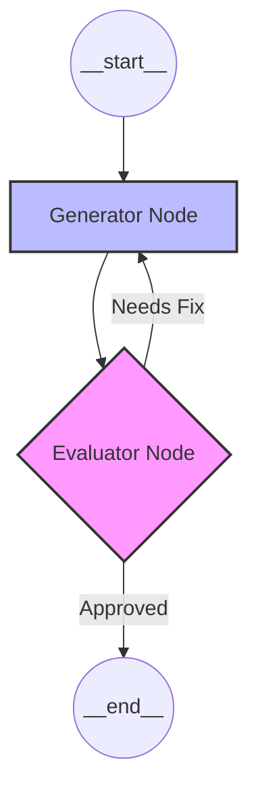

# 🧠 Comprehensive Guide to LangGraph: Theory, Patterns, and Implementation

Welcome to this end-to-end deep dive into **LangGraph**. This guide is designed to take you from the fundamental "Why" to advanced architectural patterns with real-world code and examples.

---

## 1. What is LangGraph? (01:14)

### The Theory
Traditional LLM frameworks (like LangChain's basic Chains) are primarily **DAGs (Directed Acyclic Graphs)**. They move in one direction: Input -> Process -> Output. 

However, real-world cognitive processes are messy and iterative. We think, we try, we fail, we refine. **LangGraph** is a library built on top of LangChain to create **stateful, multi-actor applications with LLMs** using cyclic graphs.

**Key Difference:**
- **Chains:** Linear, predictable, no loops.
- **LangGraph:** Cyclic, stateful, capable of complex "reasoning loops."

### Real-Life Example
Imagine a **Software Bug Fixing Flow**. 
1. A developer writes code.
2. A compiler checks it.
3. If it fails, the developer gets the error and *loops back* to fix it.
A simple linear chain can't "loop back" easily. LangGraph handles this naturally.

---

## 2. LLM Workflows (05:43)

### The Theory
An LLM Workflow is the orchestration of multiple LLM calls or tool uses to achieve a complex goal. Instead of one massive prompt, we break the task into smaller, manageable steps.

### Strategic Goal
- **Modularity:** Each step handles one thing.
- **Reliability:** You can test and refine individual nodes.

---

## 3. Prompt Chaining (09:07)

### The Theory
The simplest pattern. The output of one LLM call is the input to the next.

### LangGraph Implementation (with Groq)
```python
import os
from typing import TypedDict
from langgraph.graph import StateGraph, START, END
from langchain_groq import ChatGroq

# Setup Groq LLM
llm = ChatGroq(model="llama-3.3-70b-versatile", api_key="YOUR_GROQ_API_KEY")

# 1. Define State
class State(TypedDict):
    topic: str
    outline: str
    content: str

# 2. Define Nodes
def generate_outline(state: State):
    prompt = f"Create a brief outline for an article about {state['topic']}"
    response = llm.invoke(prompt)
    return {"outline": response.content}

def write_article(state: State):
    prompt = f"Using this outline: {state['outline']}, write a summary."
    response = llm.invoke(prompt)
    return {"content": response.content}

# 3. Build Graph
workflow = StateGraph(State)
workflow.add_node("planner", generate_outline)
workflow.add_node("writer", write_article)

workflow.add_edge(START, "planner")
workflow.add_edge("planner", "writer")
workflow.add_edge("writer", END)

app = workflow.compile()
```

---

## 4. Routing (11:17)

### The Theory
Routing allows the graph to choose different paths based on the LLM's output. It uses **Conditional Edges**.

### Real-Life Example: Customer Support
A router analyzes a query:
- If it's about **Billing**, route to the `Billing Node`.
- If it's about **Technical Support**, route to the `Tech Node`.

### Code Logic
```python
def router(state: State):
    # Logic to decide next node
    if "urgent" in state['content'].lower():
        return "priority_queue"
    return "standard_queue"

# In LangGraph:
# workflow.add_conditional_edges("classifier", router, {"priority_queue": "node_a", "standard_queue": "node_b"})
```

---

## 5. Parallelization (13:14)

### The Theory
Also known as **Fan-out / Fan-in**. Multiple nodes run at the same time, and their results are aggregated.

### Real-Life Example: Market Research
You want to analyze a stock from three perspectives simultaneously:
1. Technical Analysis.
2. Fundamental Analysis.
3. Sentiment Analysis.
Instead of doing them one by one, you run all three in parallel and then a "Summary Node" combines them.

---

## 6. Orchestrator Workers (16:11)

### The Theory
A "Manager" LLM breaks a large task into sub-tasks and assigns them to "Worker" nodes. This is common in autonomous agents.

### Example
**Task:** "Write a 5-chapter book."
- **Orchestrator:** Creates titles for Chapter 1, 2, 3, 4, 5.
- **Workers:** 5 parallel worker nodes write each chapter.
- **Orchestrator:** Reviews all chapters for consistency.

---

## 7. Evaluator Optimizer (19:48)

### The Theory
This is the **Critic/Refine** loop. 
1. **Generator:** Creates a draft.
2. **Evaluator:** Critiques the draft.
3. **Loop:** If the grade is low, send it back to the Generator with feedback.

### Why it Matters?
It dramatically improves the quality of LLM outputs by forcing "self-correction."

---

## 8. Graphs, Nodes, and Edges (23:00)

In LangGraph, the workflow is represented as a structured graph. When you visualize this graph (using tools like `graph.get_graph().draw_mermaid_png()`), each element has a specific **UI shape** and behavior.

### 🟦 Nodes (The Agents)
- **What they are:** Python functions that perform work. They receive the current `State`, modify it, and return the updates.
- **UI Shape:** **Rounded Rectangle** `(node_name)`.
- **Purpose:** Represents a specific step in the logic (e.g., "Researcher", "Writer", "Coder").
- **Special Nodes:**
  - `__start__`: The entry point (usually a Circle/Oval).
  - `__end__`: The termination point (usually a Circle/Oval).

### ➡️ Edges (The Flow)
- **What they are:** Connections that define the fixed traversal path from one node to another.
- **UI Shape:** **Solid Arrow** `A --> B`.
- **Purpose:** Used when the flow is deterministic. After Node A finished, Node B *must* run.

### 🔶 Conditional Edges (The Router)
- **What they are:** Logic-based transitions. A function (the "router") looks at the state and decides which node to visit next.
- **UI Shape:** **Diamond** or **Branching Path**.
- **Purpose:** Implements decision-making. 
  - *Example:* "If LLM output contains 'error', go to `Fixer Node`; else, go to `Publisher Node`."

### Visual Representation (Mermaid)
Here is how the "UI" of an Evaluator-Optimizer looks in code-design:



| Element | Graph Component | Visual Shape |
| :--- | :--- | :--- |
| **Node** | `workflow.add_node()` | Rectangle / Box |
| **Edge** | `workflow.add_edge()` | Straight Line / Arrow |
| **Conditional Edge** | `workflow.add_conditional_edges()` | Divided Arrow / Diamond |
| **State** | `TypedDict` | The "data" residing inside the shapes |

---

## 9. State (30:53)

### The Theory
State is the **Shared Memory** of your graph. Every node reads from it and writes to it.
In LangGraph, state is persistent. If you use a `Checkpointer`, you can even pause the graph, close the program, and resume it later.

---

## 10. Reducers (36:07)

### The Theory
How should LangGraph handle multiple nodes writing to the same key?
By default, a newer node **overwrites** the existing value. A **Reducer** tells LangGraph to do something else (like *appending* to a list).

### Code Example
```python
from typing import Annotated
import operator

class State(TypedDict):
    # 'operator.add' is a reducer that appends to the list instead of overwriting
    messages: Annotated[list[str], operator.add] 
```

---

## 11. LangGraph Execution Model (44:38)

### How it works:
1. **The Pregel Algorithm:** LangGraph is inspired by Google's Pregel.
2. **Steps:** 
   - A node executes.
   - It updates the state.
   - The graph checks the edges.
   - The next node(s) are put into a "queue."
3. **Snapshotting:** You can "Time Travel" back to any previous state of the graph to debug.

---

## 🚀 Summary Checklist
- [ ] **Define your State** (What data moves?).
- [ ] **Define your Nodes** (What actions happen?).
- [ ] **Define your Edges** (How does it flow?).
- [ ] **Compile** (Create the executable app).

LangGraph turns LLMs from "Chatbots" into "Reliable Systems."
